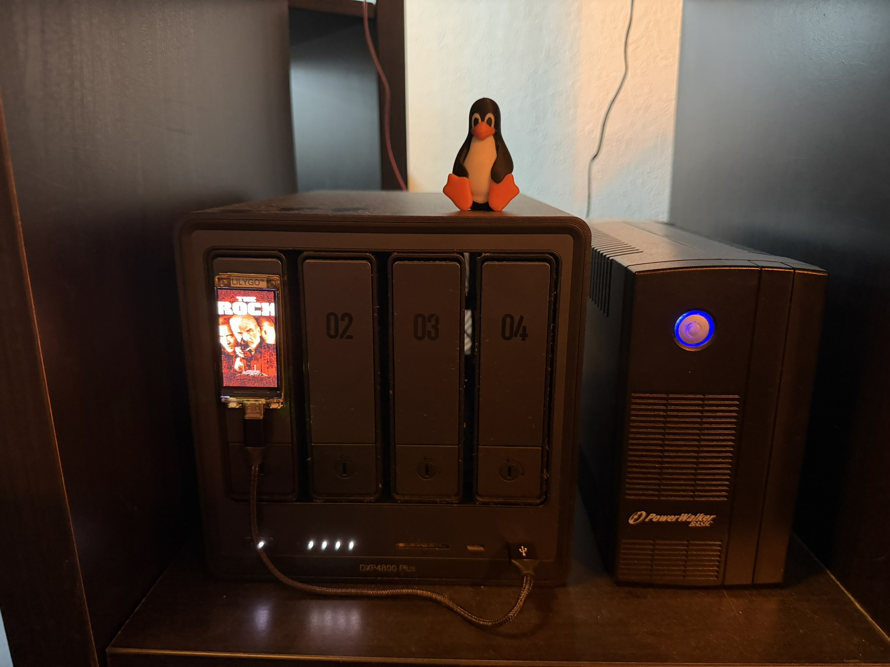
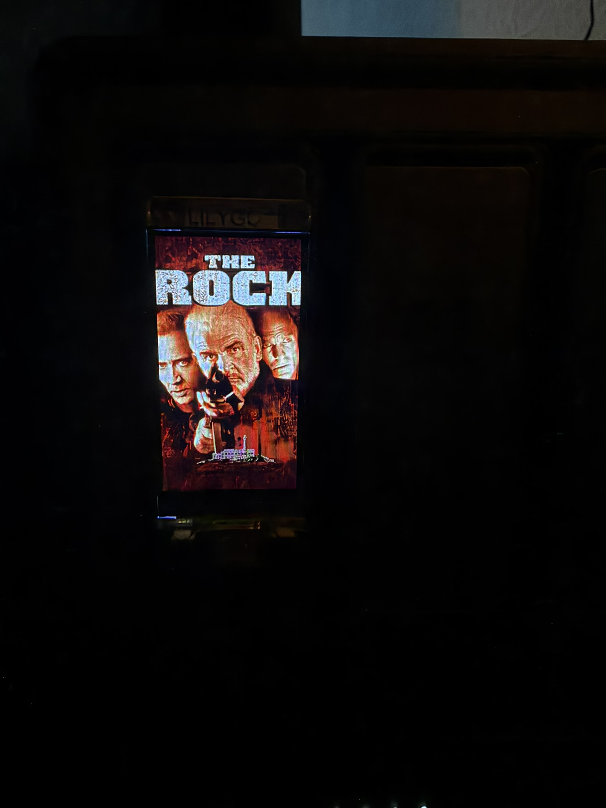

# unraid-t-display

ESP32/LILYGO T-Display project for Unraid server monitoring with a switchable cover view for the latest imported movie or series.

`service/` contains the Unraid cover service for Radarr and Sonarr. Firmware is maintained separately; this change does not flash or modify the display.

`firmware/` contains the complete PlatformIO/Arduino firmware for the LilyGO T-Display-S3: the existing Unraid status screen, the persistent cover view, GPIO14 mode switching, LittleFS/NVS persistence and the display HTTP endpoints. Create a local ignored `firmware/include/secrets.h` before compiling.

## Fotos aus dem Aufbau






## Radarr and Sonarr

In **Settings → Connect → + → Webhook** create or keep the `LilyGO Cover` webhook:

- Radarr: `http://192.168.178.56:8089/webhook/radarr/WEBHOOK_TOKEN` (`movie.id`)
- Sonarr: `http://192.168.178.56:8089/webhook/sonarr/WEBHOOK_TOKEN` (`series.id`)
- Method: **POST**.
- Enable **On Import** and **On Upgrade**; leave other events disabled.
- Replace `WEBHOOK_TOKEN` with the existing value in the service's private `.env`.
- Run **Test**, then save. A test returns HTTP 200 and does not replace the cover.

Only successful `Download` events enqueue work. Posters are read from `/posters/<source>/<id>/poster.jpg`. SQLite `/data/state.sqlite` persists the newest received import and prepared frame; delivery retries every ten seconds when a poster or the display is temporarily unavailable.

The service crops posters to 170 × 320 RGB565LE, checks the device's `/info` endpoint, and sends `/cover` with a SHA-256 digest. No Arr API keys are needed during normal operation. Display and webhook secrets belong only in `.env`; never commit them.

## Run / test

Adapt paths in `service/compose.yaml` to the actual installation. Preserve the `/data` volume on updates. The Compose example uses service name `display-cover`; the existing installation uses a manually created container named `unraid-cover`.

```sh
cd service
python -m pip install -r requirements.txt
python -m unittest discover -v
docker compose up -d --build
```

The test suite covers event filtering, invalid IDs, authenticated HTTP webhooks, restart persistence, poster conversion, retry behavior and the existing Radarr/Sonarr paths. Tests use temporary state and a simulated display.

## Deployment verification — 14 September 2026

- Sonarr notification ID 13 and Radarr ID 12: `LilyGO Cover`, imports/upgrades enabled; existing configuration preserved.
- The service was tested locally and in an isolated container on Unraid.
- The real display reports available storage and RGB565LE support.
- The deployed container uses port `192.168.178.56:8089` and restart policy `unless-stopped`.
- Private configuration and state backups remain under `/mnt/user/appdata/unraid-cover/` and are not committed.
