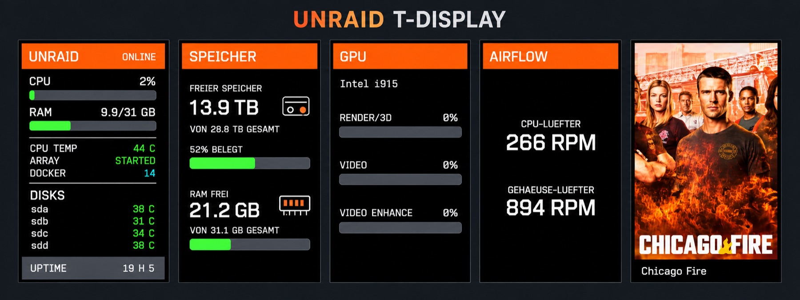

# unraid-t-display

ESP32/LILYGO T-Display project for Unraid server monitoring with a switchable cover view for the latest imported movie or series.

`service/` contains the Unraid cover service for Radarr and Sonarr. Firmware is maintained separately; this change does not flash or modify the display.

`firmware/` contains the complete PlatformIO/Arduino firmware for the LilyGO T-Display-S3: the existing Unraid status screen, the persistent cover view, five display pages and GPIO14 page switching, LittleFS/NVS persistence and the display HTTP endpoints. Create a local ignored `firmware/include/secrets.h` before compiling.

## Promo overview



[Watch the demo video](https://raw.githubusercontent.com/n0n1Ck-ctrl/unraid-t-display/main/docs/images/IMG_5090-compressed.mp4)

## Radarr and Sonarr

In **Settings → Connect → + → Webhook** create or keep the `LilyGO Cover` webhook:

- Radarr: `http://<unraid-ip>:8089/webhook/radarr/<webhook-token>` (`movie.id`)
- Sonarr: `http://<unraid-ip>:8089/webhook/sonarr/<webhook-token>` (`series.id`)
- Method: **POST**.
- Enable **On Import** and **On Upgrade**; leave other events disabled.
- Replace `WEBHOOK_TOKEN` with the existing value in the service's private `.env`.
- Run **Test**, then save. A test returns HTTP 200 and does not replace the cover.

Only successful `Download` events enqueue work. Posters are read from `/posters/<source>/<id>/poster.jpg`. SQLite `/data/state.sqlite` persists the newest received import and prepared frame; delivery retries every ten seconds when a poster or the display is temporarily unavailable.

The service crops posters to 170 × 320 RGB565LE, checks the device's `/info` endpoint, and sends `/cover` with a SHA-256 digest. No Arr API keys are needed during normal operation. Display and webhook secrets belong only in `.env`; never commit them.

## Run / test

Adapt paths in `service/compose.yaml` to the actual installation. Preserve the `/data` volume on updates. The Compose example uses service name `display-cover`; the existing installation uses a manually created container named `unraid-cover`.

```sh
cd service
python -m pip install -r requirements.txt
python -m unittest discover -v
docker compose up -d --build
```

The test suite covers event filtering, invalid IDs, authenticated HTTP webhooks, restart persistence, poster conversion, retry behavior and the existing Radarr/Sonarr paths. Tests use temporary state and a simulated display.

## Display update — September 2026

The right button (GPIO14) cycles through **Unraid → Storage/RAM → GPU → Airflow → Poster**. The left button (GPIO0) redraws the current status page from the latest cached response; it does not trigger an immediate server measurement or refresh the poster. Status polling continues every five seconds.

Poster titles are static, without an appended year. Long titles are clipped; season/episode metadata is displayed when supplied. Storage and RAM use matching typography and bars. The connection screen shows a white Wi-Fi icon with a red cross. Airflow uses centered labels and RPM values without icons.

The `/status` response must additionally contain:

```json
{
  "storage": {"free_bytes": 15263788695552, "total_bytes": 31717526470656},
  "memory": {"used": 6460, "total": 31870},
  "gpu": {"name": "Intel i915", "render": 0, "video": 0, "video_enhance": 0},
  "fans": [{"name": "FAN 1", "rpm": 268}, {"name": "FAN 2", "rpm": 975}]
}
```

This installation uses a pooled storage setup without a traditional Unraid parity array. Storage reporting is therefore installation-specific; for an array/parity setup, adjust and verify the dataset, mount path and query.

Storage values are bytes; memory values are MiB. The current firmware divides by powers of 1024, although its labels say TB/GB (numerically TiB/GiB). Select the actual storage dataset, not the cache pool. The host-side status script and API are installation-specific and are not included in this repository snapshot.

Fan roles must be verified against the physical connectors: the two sensors both report `Array Fan`, so their order alone does not establish CPU versus case fan. GPU fallback zeros do not prove a successful measurement or the absence of transcoding.

Build and upload from `firmware/` using `pio run` and `pio run -t upload --upload-port <current-port>`. Discover the current port with `pio device list`. Keep `include/secrets.h` local and ignored. The older deployment notes in `firmware/README.md` describe the initial installation, before these display updates.

## Sonarr episode metadata

Import webhooks read `episodes[]` for season and episode numbers, with a fallback to the older singular `episode` object. Multi-episode imports show the highest season/episode pair in that event. Season 0 specials are supported. Updating the service applies this to subsequent imports; previously stored imports with missing episode metadata require a new import notification.
